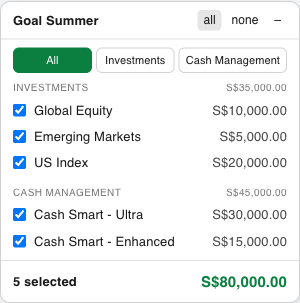

# Endowus Goal Summer

A browser userscript that adds a floating panel to the [Endowus](https://app.sg.endowus.com/dashboard) dashboard so you can select any subset of your goals (portfolios) and see their **combined value** in real time.

## Features

- ✅ **Per-goal checkboxes** with a live running total
- 🗂️ **Category filter** — `All` / `Investments` / `Cash Management` tabs, with per-category subtotals in the combined view
- ⚡ **Quick select** — `all` / `none` buttons that act only on the goals shown by the current filter
- 💾 **Persistent** — your selection and active filter survive reloads (stored in `localStorage`)
- 🖱️ **Draggable & minimizable** panel
- 🌗 **Light/dark mode** aware

## Install

1. Install a userscript manager:
   - [Tampermonkey](https://www.tampermonkey.net/) (Chrome, Edge, Firefox, Safari)
   - [Violentmonkey](https://violentmonkey.github.io/) (Chrome, Edge, Firefox)
2. Install the script:
   - **From Greasy Fork:** *(link added after first publish)*
   - **From GitHub:** open [`endowus-goal-summer.user.js`](https://raw.githubusercontent.com/sfdye/endowus-goal-summer/main/endowus-goal-summer.user.js) — your userscript manager will prompt to install.
3. Open <https://app.sg.endowus.com/dashboard> and log in. The **Goal Summer** panel appears bottom-right.

## Usage

- Tick the goals you want to include; the footer shows the count and the combined value.
- Use the tabs to filter by category. In the `All` view, each category shows its own selected subtotal.
- `all` / `none` select/clear every goal currently shown by the active filter.
- Drag the header to reposition; click `–` to minimize.

## How it works

The script scrapes each goal card on the dashboard, reads its name and `S$` value, and infers its category from the surrounding section header (`Investments` / `Cash Management`). It re-scrapes automatically when the single-page app re-renders.

> **Note:** Endowus uses Tailwind-style utility classes that can change between deploys. If the panel ever shows 0 goals, the card selectors likely changed — please [open an issue](https://github.com/sfdye/endowus-goal-summer/issues).

## Privacy

Everything runs locally in your browser. No data is sent anywhere; the only storage used is `localStorage` on the Endowus domain to remember your selection.

## License

[MIT](LICENSE)
